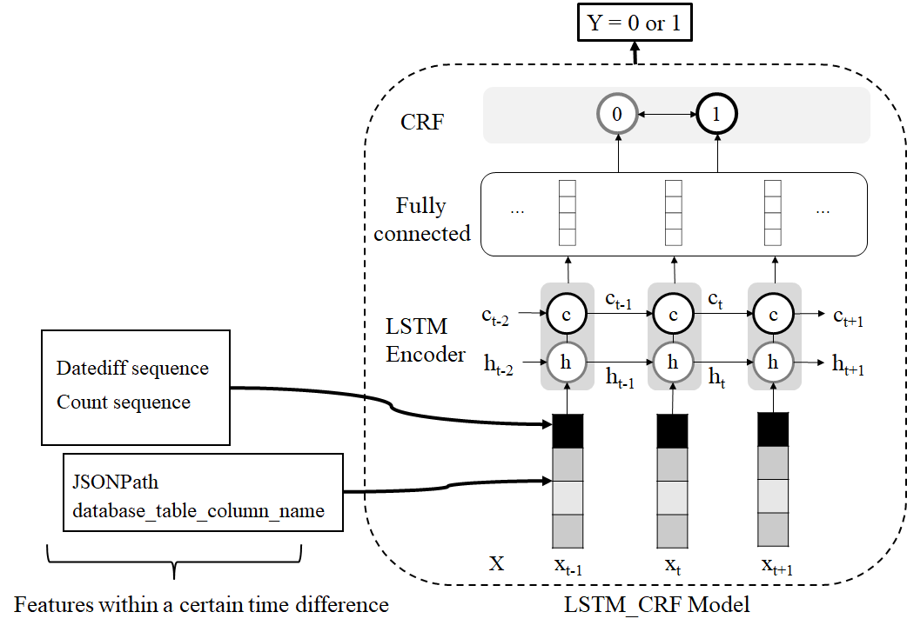

# Maxson-ML
:book: **简介**

___

这是Maxson系统中的JSONPath预测器部分的实现代码。代码部分使用了中文注释，关于json配置文件的各项说明见 *configuration.md*。


**JSONPath Predictor概览图：**
<div align=center>
  
**Maxson-ML运行流程图：**  
<div align=center>


- **目录介绍**
  - `data` ：数据集文件夹， *full_set_group_json.txt* 是训练时所用的数据集。*predict.txt* *train.txt* 预测及训练数据集，*14_feature_xx.txt* 根据数据集构造特征生成文件，作为模型输入。*prediction*文件夹下为预测数据，其格式为：`JSONPath^^次数^^时间`。
  - `model` ：训练生成模型文件夹。
  - `bconfig.json` :  构建特征时所需的配置文件。
  - `buildFeature.py` : 构建输入模型特征数据程序。
  - `config.json` : *lstm_crf* 模型所需配置文件，训练或预测时都需要。
  - `lstmcrf_pred.py` ：获取*lstm_crf* 模型预测结果程序。
  - `lstmcrf_train.py` ：训练 *lstm_crf* 模型程序。
  - `preprocess.py` ：预处理程序，主要用于检查数据是否遗漏天数，补全未出现数据次数为0，划分数据集，训练Word2Vec模型等操作。
  - `wordModel_50_4.model` ：训练生成的Word2Vec模型。


 :wrench:  **环境**

____

- Python3.7及以上
  - torch 1.0.1

  - numpy 1.16.2

  - gensim 3.8.1

  - sklearn-crfsuite   0.3.6

    

 :clapper: ​ **运行**

___

1. 准备好采集完的数据，作为输入，格式可以自定义但需要与 *bconfig.json* 中定义一致。

2. 运行 `Preprocess.py`  检查数据完整性，划分训练数据集和预测数据集（使用时无需划分），通过输入数据训练Word2Vec模型（用于将JSONPath等特征向量化）。

   ```shell
   python Preprocess.py
   ```

3. 运行 `buildFeature.py`  构建特征用于 *lstm_crf* 模型的输入.

   `./xx filepath configpath`

   （*bconfig.json* 中定义了数据的属性及一些特征的参数, 比如 窗口大小，Word2Vec模型的位置 等。）

   ```shell
   python buildFeature.py data/predict.txt bconfig.json
   ```

4. 运行 `lstm_crf_pred.py` 用于预测结果。若需要训练模型则先运行 `lstm_crf_train.py` 再运行预测即可。整个预测器的输出在预测文本文件中，其位置在 *config.json* 文件中定义。

   ```shell
   python lstm_crf_pred.py config.json
   ```

   


